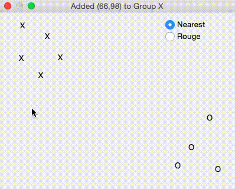

# Linear Classifier

A graphical linear classifier test program.

## Screenshot ##

## More?

`classifyNearest` function uses Nearest Neighbor classifier algorithm.
`classifyRouge` function uses Euclidean distance classifier algorithm.